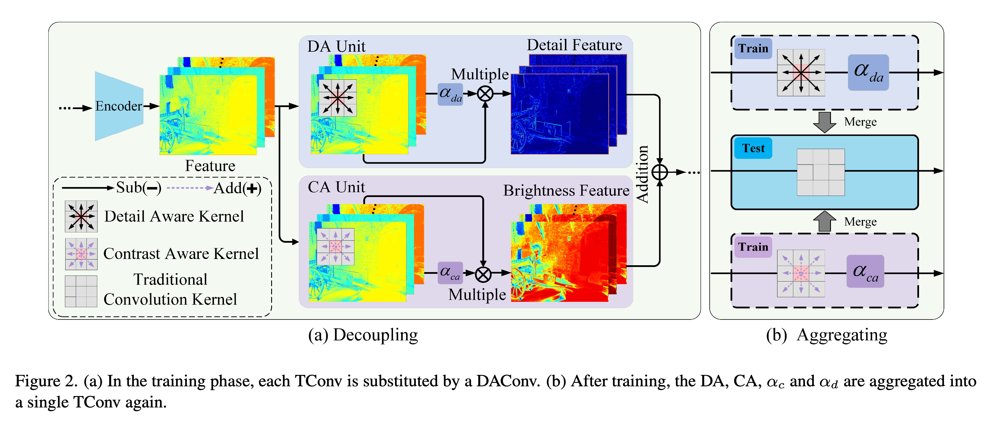

# Decoupling-and-Aggregating for Image Exposure Correction (CVPR2023)
[[CVPR2023 Paper Download](https://openaccess.thecvf.com/content/CVPR2023/papers/Wang_Decoupling-and-Aggregating_for_Image_Exposure_Correction_CVPR_2023_paper.pdf)] 


I'm sorry for the delay in open-sourcing this work due to patent and company policy reasons. This is the official PyTorch code for the paper.

> **Decoupling-and-Aggregating for Image Exposure Correction**
> <br> Yang Wang\*, Long Peng\* (First student author), Liang Li, Yang Cao, Zheng-Jun Zha (\* indicates co-first author)<br>


<!--  -->


## Abstract
The images captured under improper exposure conditions often suffer from contrast degradation and detail distortion. Contrast degradation will destroy the statistical properties of low-frequency components, while detail distortion will disturb the structural properties of high-frequency components, leading to the low-frequency and high-frequency components being mixed and inseparable. This will limit the statistical and structural modeling capacity for exposure correction. To address this issue, this paper proposes to decouple the contrast enhancement and detail restoration within each convolution process. It is based on the observation that, in the local regions covered by convolution kernels, the feature response of low-/high-frequency can be decoupled by addition/difference operation. To this end, we inject the addition/difference operation into the convolution process and devise a Contrast Aware (CA) unit and a Detail Aware (DA) unit to facilitate the statistical and structural regularities modeling. The proposed CA and DA can be plugged into existing CNN-based exposure correction networks to substitute the Traditional Convolution (TConv) to improve the performance. Furthermore, to maintain the computational costs of the network without changing, we aggregate two units into a single TConv kernel using structural re-parameterization. Evaluations of nine methods and five benchmark datasets demonstrate that our proposed method can comprehensively improve the performance of existing methods without introducing extra computational costs compared with the original networks.


## Framework of our proposed DAConv 



## Dataset
- MSEC dataset (please refer to https://github.com/mahmoudnafifi/Exposure_Correction)
- SICE train dataset (I have uploaded it to BaiDuWangPan: https://pan.baidu.com/s/1-htOcu2VVbVDTV-EThk8IQ password: 7ryr)
- SICE test dataset (I have uploaded it to BaiDuWangPan: https://pan.baidu.com/s/1vfEhHnc0qjUz6OLUuQd3SA password: bdsi)
- LOLV1 (please refer to https://daooshee.github.io/BMVC2018website/)
- LOLV2-Real and LOLV2-Synthetic (please refer to https://flyywh.github.io/IJCV2021LowLight_VELOL/)

## Quick demo 

Our proposed Decoupling-and-Aggregating Convolution (DAConv) can be used as a general base convolution unit to replace Vanilla Convolution (VConv) to improve image details and contrast enhancement performance for image exposure correction. Here is a quick example.

**Using CNN and our DAConv is exactly the same, they have the same API.**

```
import torch
import torch.nn as nn 
from decouple_conv.ops_decouple import decouple_conv_layer

a = torch.randn(size=(1,3,256,256))
#CNN
cnn_layer = nn.Conv2d(in_channels=3,out_channels=8,kernel_size=3,padding=1,stride=1)
#Proposed DAConv
daconv_layer = decouple_conv_layer(in_channels=3,out_channels=8,kernel_size=3,padding=1,stride=1)
print(cnn_layer(a).shape)
print(daconv_layer(a).shape)
```

## FileDescription

* The ops.py file contains CAUnit and DAUnit classes, corresponding to CA Unit and DA Unit in the paper.
* The ops_decouple.py file contains DAConv class, corresponding to DAConv  in the paper.
* You can use decouple_conv_layer function in ops_decouple.py. It has almost the same API as nn.Conv2d as Quick Example:
* merge_network.py provides the fusion process of the PRenet model. You can use the merge_network_re function in this file to merge all DAconv-based models to the VC-based model and get the same structure and computational cost as the original CNN-based network.
* Please refer to the code file for more details.


## Example 
Hopefully, our proposed DAConv help improve the performance of more methods in the future. If our proposed DAConv is useful to your work, welcome to star and follow it.


Our proposed Decoupling-and-Aggregating Convolution (DAConv) can be used as a general base convolution unit to significantly improve the image detail and contrast enhancement performance of existing methods while maintaining the same computational costs as the original networks.

***The main steps are as follows***
- **step1**: Download the code of the VC-based method on GitHub.
- **step2**: Replace all cnn_layer in the network with daconv_layer as shown in Quick Use.
- **step3**: Install requirements and train the network using the original code. 
- **step4**: After training, you'll get a DAConv-based network with better image exposure correction performance.
- **step5**: Before inferencing, we need to perform equivalent parameter fusion (as shown in the section Aggregating of our paper) for the DAConv-based network, using the example shown by decouple_conv/merge_network.py

Here we show you code how to train DAConv-based and VC-based ZeroDCE.


```
#CNN
cd ./Zero-DCE_code_CNN
python3 lowlight_train.py #Please check the data set path and save model path

#DAConv
cd ./Zero-DCE_code_DAConv
python3 lowlight_train.py #Please check the data set path and save model path

python3 merge_zeroDCE.py ##Please check the model ckp path and save model path
```

## Citation

If you find our repo useful for your research, please cite us:

```
@inproceedings{wang2023decoupling,
  title={Decoupling-and-Aggregating for Image Exposure Correction},
  author={Wang, Yang and Peng, Long and Li, Liang and Cao, Yang and Zha, Zheng-Jun},
  booktitle={Proceedings of the IEEE/CVF Conference on Computer Vision and Pattern Recognition},
  pages={18115--18124},
  year={2023}
}
```
